# İzmir Ferry

A ferry information Android application for İzmir/Turkey.

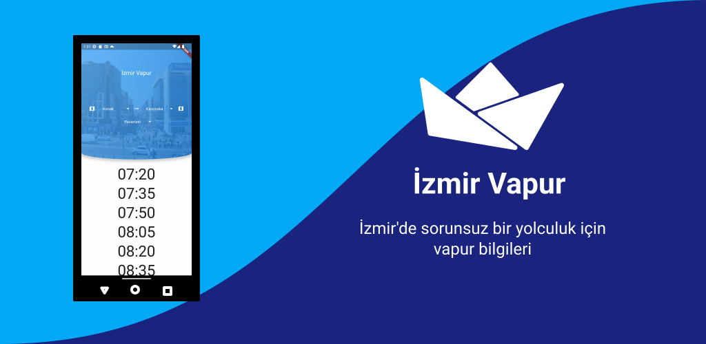

## Download

## Features

 - Dynamic changing background depending on destination station
 - You can check locations of stations if you don't know where they are.
 - Current day is automatically selected.

## Screenshots

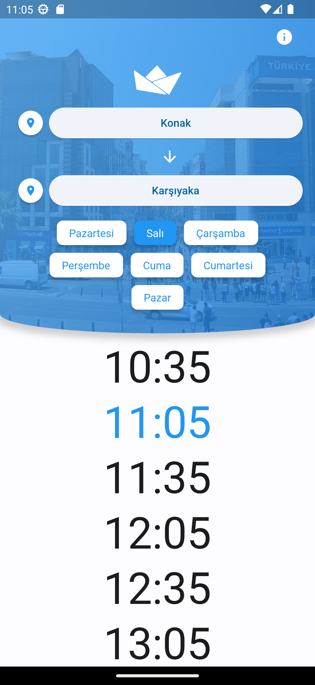
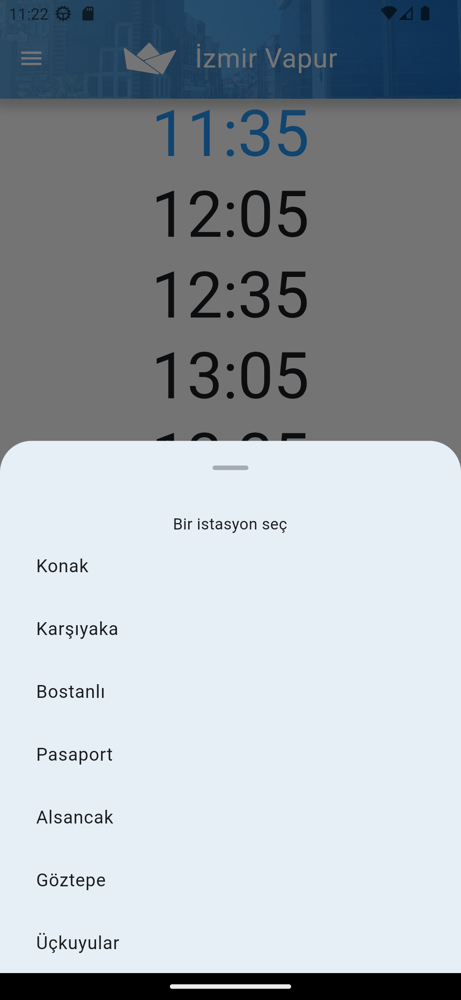
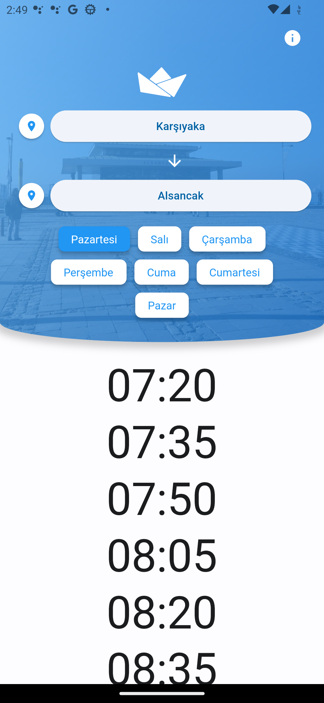
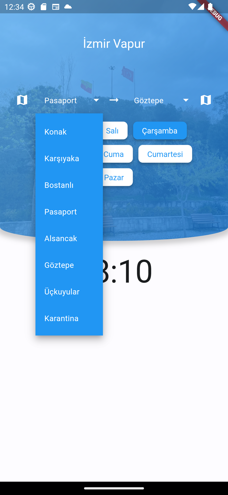
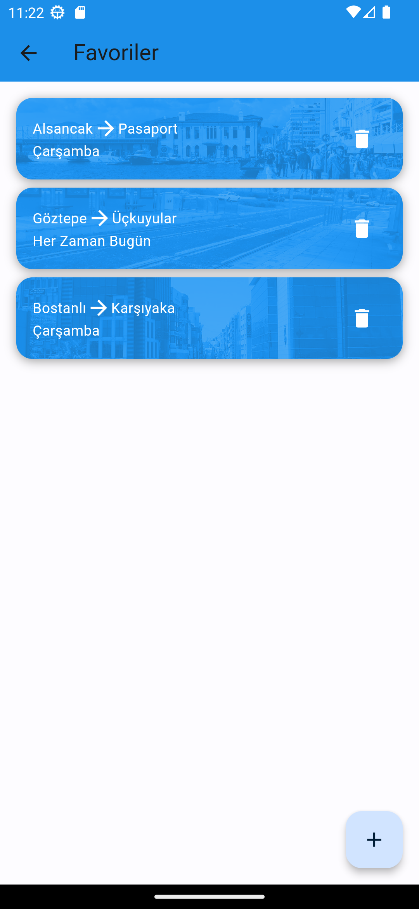
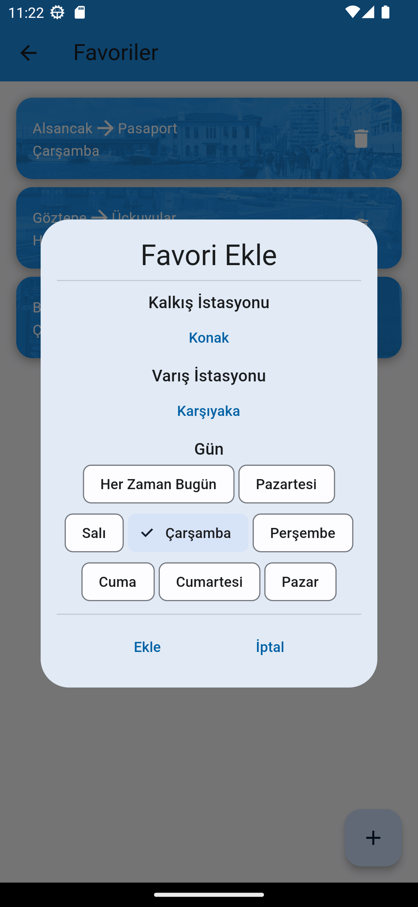
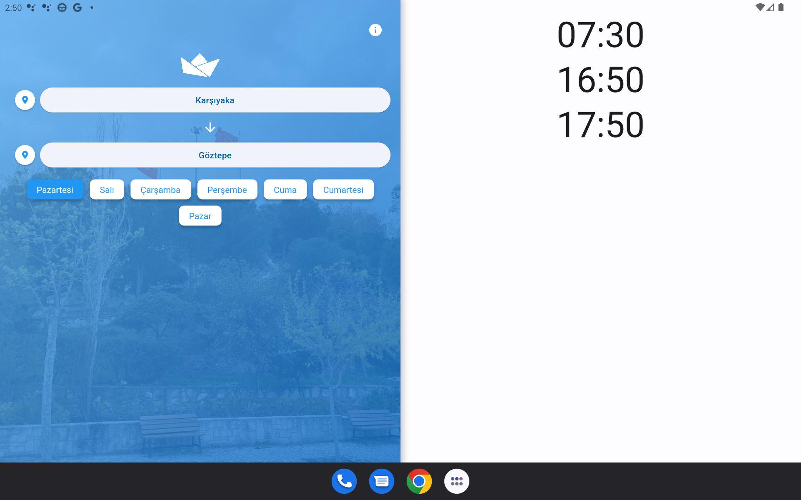
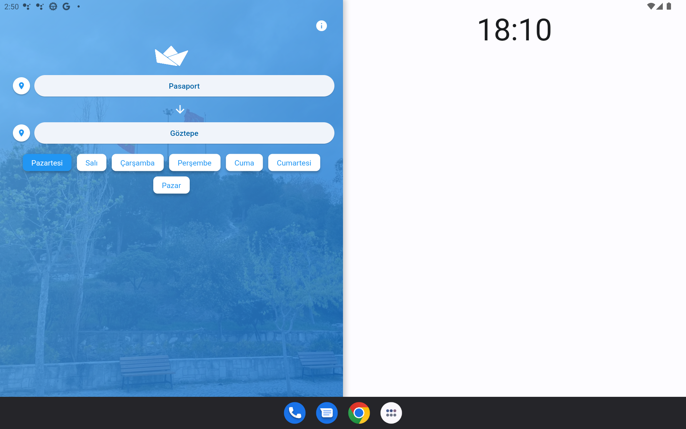
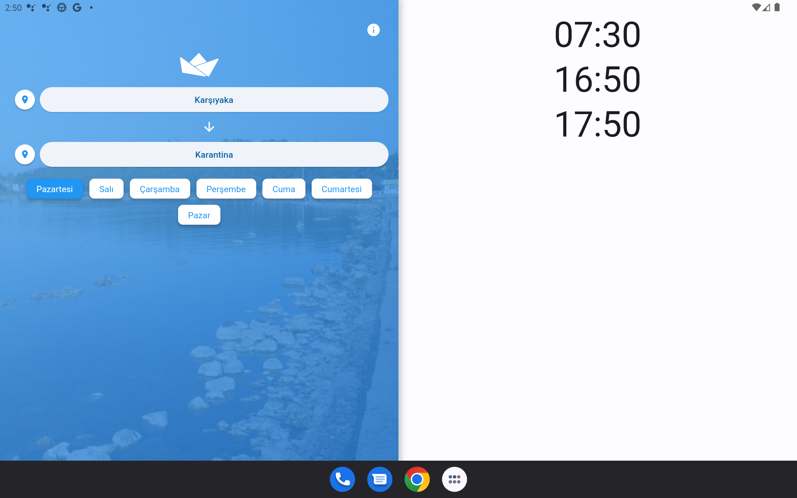
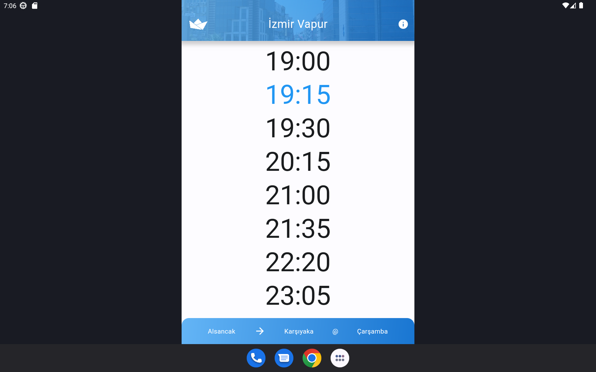
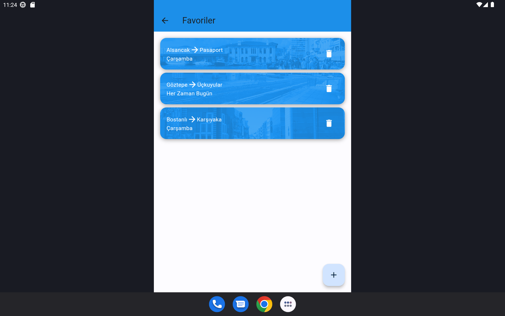
